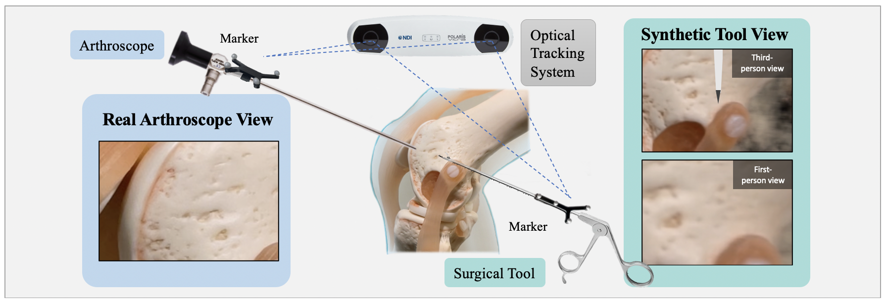

# ARthroNeRF_view_synthesis
This repository contains the code for our exploratory work on integrating Instant NeRF (Neural Radiance Fields) and an Optical Tracking System.

## Usage
### Data Collection
To start collecting data, navigate to the `DataCollected` directory and follow the instructions there.
### Training NeRF
Train NeRF using our modified instantNGP implementation located in the `NeRF_instant` directory.
## Preparation
### NDI Configuration
To use the NDI (Northern Digital Inc.) tracking system, ensure you have the necessary ROM files. Replace the ROM files in the specified locations as detailed in the README files of both `DataCollected` and `NeRF_instant` directories.

## Example Data
You can find an example dataset [here](https://drive.google.com/drive/folders/1iAXOFB5H9r8EnBwrasXMcHXizGN6QYHA?usp=sharing). To use these data, replace the corresponding transforms.json file in the original INSTANT NGP configuration with the provided example data.
